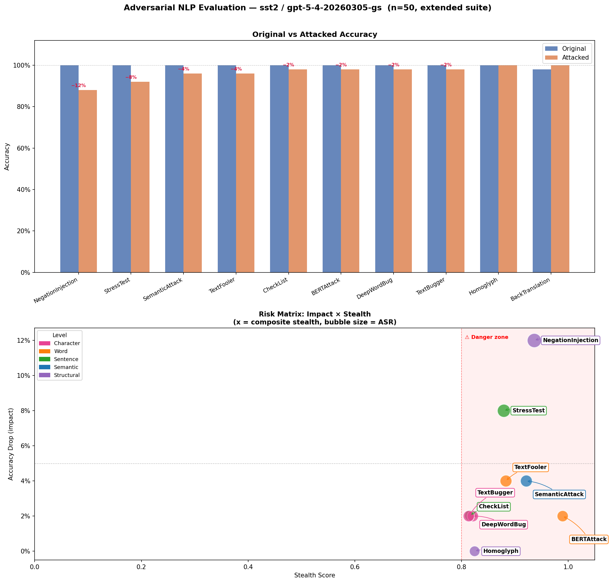

<div align="center">

# 🔴 LLM Red Teaming

**A modular, extensible toolkit for adversarial testing of large language models and NLP systems.**

[](https://www.python.org/)
[](LICENSE)
[]()
[](CONTRIBUTING.md)

*Adversarial text attacks · prompt injection · jailbreaking · fairness probing · pluggable model targets*

</div>

---

## 📖 Overview

Modern AI systems are increasingly deployed in sensitive contexts — yet their robustness to adversarial inputs remains poorly understood. **LLM Red Teaming** provides a structured, reproducible framework to:

- **Attack** language models at multiple levels: character, word, sentence, semantic, and prompt
- **Jailbreak** instruction-tuned LLMs using standardised benchmarks and custom templates
- **Evaluate** robustness metrics: accuracy drop, attack success rate (ASR), stealth score, risk score
- **Flag** high-risk adversarial examples for human review with priority queuing
- **Align** every evaluation to industry standards: MITRE ATLAS, NIST AI RMF, NIST AI 600-1, and OWASP LLM Top 10

The library grows in tiers — from adversarial NLP benchmarks through prompt injection, bias testing, and multi-turn manipulation. Each module is independently usable or composable into full evaluation pipelines.

---

## 🗂️ Repository Structure

```
llm_red_teaming/
│
├── attacks/                    # All attack implementations
│   ├── character/              # TextBugger, DeepWordBug              [✅ implemented]
│   ├── word/                   # TextFooler, BERTAttack                [✅ implemented]
│   ├── sentence/               # CheckList, StressTest                 [✅ implemented]
│   ├── semantic/               # SemanticAttack                        [✅ implemented]
│   ├── structural/             # BackTranslation, Homoglyph, Negation  [✅ implemented]
│   └── prompt/                 # Injection, jailbreak, role-play       [🔜 next]
│
├── judges/                     # Response evaluation
│   └── classifier_judge.py     # Rule-based + zero-shot BART-MNLI judge
│
├── targets/                    # Model connectors (pluggable)
│   └── azure_openai.py         # Azure OpenAI / APIM gateway
│
├── evaluate/                   # Metrics and reporting
│   ├── metrics.py              # ASR, risk score, human review queue   [✅ implemented]
│   ├── adversarial_eval.py     # run_all_attacks() pipeline            [✅ implemented]
│   ├── stealth.py              # Composite stealth score               [✅ implemented]
│   ├── plots.py                # Risk matrix + accuracy bar charts     [✅ implemented]
│   ├── display.py              # Human review display helper           [✅ implemented]
│   ├── regulatory.py           # Dynamic regulatory impact mapping     [✅ implemented]
│   ├── consistency.py          # Paraphrase & self-consistency         [📋 planned]
│   └── fairness.py             # Counterfactual demographic scorer     [📋 planned]
│
├── eval_datasets/              # Evaluation datasets
│   ├── sst2/                   # SST-2 sentiment benchmark             [✅ implemented]
│   ├── nli/                    # SNLI, MultiNLI, ANLI, AdvGLUE         [📋 planned]
│   ├── toxicity/               # ToxiGen, HateXplain                   [📋 planned]
│   └── safety/                 # AdvBench, HarmBench jailbreak banks   [📋 planned]
│
├── notebooks/                  # Lightweight demo notebooks
│   ├── 01_adversarial_nlp_demo.ipynb   # 10 attacks × SST-2 [✅]
│   ├── 02_jailbreaking_demo.ipynb      # JailbreakBench    [✅]
│   ├── 03_prompt_injection.ipynb       # Direct + indirect  [🔜]
│   ├── 04_fairness_counterfactual.ipynb # Demographic swap  [📋]
│   └── 05_nli_robustness.ipynb         # AdvGLUE + ANLI    [📋]
│
├── docs/images/                # Figures referenced in README
├── configs/                    # Experiment configuration files
├── results/                    # Output files (gitignored)
├── .env.example                # API key template
├── requirements.txt
└── LICENSE
```

---

## 🚀 Quick Start

```bash
git clone https://github.com/minw0607/llm_red_teaming.git
cd llm_red_teaming
pip install -r requirements.txt
cp .env.example .env          # fill in your Azure OpenAI credentials
```

Open `notebooks/01_adversarial_nlp_demo.ipynb` and set `N_SAMPLES` in the config cell. Everything else runs end-to-end.

```python
# Programmatic usage
from attacks.character import TextBugger
from attacks.word import TextFooler
from targets.azure_openai import AzureOpenAITarget
from evaluate import run_all_attacks, compute_attack_summary

attacks = {"TextBugger": TextBugger(), "TextFooler": TextFooler()}
target  = AzureOpenAITarget()
results = run_all_attacks(attacks, target, eval_df, n_samples=50)
summary = compute_attack_summary(results)
```

---

## 📈 Full Run Results (n = 872)

Results from Notebook 01 — **10 adversarial attacks** evaluated on **872 SST-2 samples** against an Azure-hosted frontier model (`gpt-5-4-20260305-gs`). At this scale each percentage point represents ~8–9 real prediction flips, making the rankings stable and operationally meaningful.

### Risk Matrix & Accuracy Comparison



*Bubble size = Attack Success Rate (ASR). Shaded region = stealth ≥ 0.80 (danger zone).*

### Attack Summary (n = 872 samples, SST-2 sentiment, sorted by risk score)

| Attack | Level | Orig Acc | Attacked Acc | Acc Drop | ASR | Stealth | Risk Score |
|---|---|---|---|---|---|---|---|
| 🔴 **NegationInjection** | structural | 95.5% | 78.1% | **+17.5%** | 19.6% | 0.941 | **0.1647** |
| 🟠 **StressTest** | sentence | 95.5% | 92.2% | +3.3% | 4.5% | 0.888 | 0.0293 |
| 🟡 **BackTranslation** | structural | 95.2% | 93.5% | +1.7% | 2.8% | 0.897 | 0.0153 |
| 🟡 **TextFooler** | word | 95.7% | 94.1% | +1.6% | 2.7% | 0.872 | 0.0140 |
| 🟡 **SemanticAttack** | semantic | 95.5% | 94.6% | +0.9% | 1.8% | 0.901 | 0.0081 |
| **TextBugger** | character | 95.2% | 94.7% | +0.5% | 1.6% | 0.816 | 0.0041 |
| **BERTAttack** | word | 95.5% | 95.2% | +0.4% | 1.0% | — | — |
| **DeepWordBug** | character | 95.0% | 95.2% | −0.1% | 0.9% | 0.833 | 0.0000 |
| **CheckList** | sentence | 95.5% | 95.7% | −0.2% | 0.7% | 0.818 | 0.0000 |
| **Homoglyph** | structural | 95.3% | 95.9% | −0.6% | 1.0% | 0.824 | 0.0000 |

*Stealth = composite score (0.5 × semantic_sim + 0.3 × naturalness + 0.2 × edit_sim). Risk Score = Acc Drop × Stealth. Negative acc drop = model improved (data cleaning / noise reduction effect).*

**Key findings at n = 872:**
- 🔴 **NegationInjection dominates**: 17.5% accuracy drop at 0.941 stealth — 5× larger than the second-ranked attack. Logically inverted text remains fluent (ppl_ratio 1.097) and is undetectable by perplexity monitors
- 🟠 **StressTest is the only other HIGH-risk attack**: 3.3% drop — vacuous tautology appended to input causes attention drift, not semantic manipulation
- 🟡 **Word/structural attacks cluster at 1–2%**: BackTranslation, TextFooler, SemanticAttack all stealth ≥ 0.87 — meaningful but individually manageable
- ✅ **Character-level attacks ineffective at frontier scale**: TextBugger (+0.5%), DeepWordBug (−0.1%) — GPT-5-class models are robust to single-character typo perturbations
- ℹ️ **Three attacks improve accuracy**: Homoglyph (−0.6%), CheckList (−0.2%), DeepWordBug (−0.1%) — perturbations land on harder sample variants, confirming these attacks have near-zero adversarial signal at this model scale

### Notable Findings & Interpretations

| Finding | What happened | Why it matters |
|---|---|---|
| **NegationInjection: 17.5% at n=872** | Gap to second-place (3.3%) is 5×, stable across 868 samples — not sampling noise | Structural logical attacks are the dominant threat for this model class. Character and word substitutions are largely solved at frontier scale; negation robustness is not. |
| **BackTranslation: +1.7% acc drop** | EN→DE→EN normalises SST-2's noisy pre-tokenised text (removes spaces, fixes capitalisation); ppl_ratio 0.906 < 1 confirms attacked text is *more fluent* than original | Confirms the data-cleaning effect holds at scale. The 2.8% ASR reflects genuine adversarial signal on a small hard subset; the net effect is mild because most samples improve after round-trip translation. |
| **BERTAttack: missing stealth data** | Stealth checkpoint did not complete for BERTAttack in this run — composite stealth columns show `—` | Risk score cannot be computed; treat as a data gap, not zero risk. Re-run `add_stealth_components()` with `checkpoint_path` to fill. Acc drop of 0.4% / ASR 1.0% visible from raw results. |
| **Character attacks: at or below baseline** | TextBugger +0.5%, DeepWordBug −0.1% at n=872 | Deprioritise in future red-team cycles. Frontier LLMs are effectively immune to surface-level typo attacks; testing budget is better spent on structural and prompt-level attacks. |
| **BERTAttack: HIGH→MEDIUM demotion** | `text_changed=False` flip cases (identical text, different model answer) correctly demoted | Model non-determinism on decision-boundary sentences, not attack success. Documented in `display_human_review()` with explicit flagging. |

### Regulatory Alignment & Executive Report

Notebook 01 auto-generates two business-facing outputs at the end of each run:

**Dynamic regulatory impact report** (`regulatory_report()` + `render_regulatory_heatmap()`):
- Finding-level citations — only attacks with meaningful impact in *this run* are reported; actual metric values (acc_drop, ASR, stealth) embedded in each citation
- Special-case detection — data-cleaning effects (BackTranslation), model non-determinism (BERTAttack), and high-stealth structural attacks each map to specific regulatory obligations
- **Frameworks:** NIST AI 600-1 (§2.3, §2.5, §2.6) · MITRE ATLAS (AML.T0043, T0015, T0016, T0040) · OWASP LLM Top 10 (LLM01, LLM09) · EU AI Act (Art. 9, 13, 15, 17)

**LLM-interpreted executive summary** (`generate_executive_summary()`):
- Judge LLM (same Azure-hosted model) receives all computed metrics and writes a plain-English narrative — numbers come from deterministic computation, not hallucination
- Covers: overall risk verdict · key findings · attack methodology · regulatory obligations · prioritised recommendations
- Saved as a **standalone HTML report** — open directly in a browser or share with leadership

```python
from evaluate import regulatory_report, render_regulatory_heatmap, generate_executive_summary

reg_df            = regulatory_report(summary_df, review_df=review_df)
render_regulatory_heatmap(reg_df, save_path='results/regulatory_heatmap.png')
exec_html, data   = generate_executive_summary(summary_df, review_df, reg_df, target, config)
```

**Saved outputs** (all in `results/`, gitignored by default):

```
01_raw_results_n872.csv          per-sample predictions (all 10 attacks × 872 rows)
01_attack_summary_n872.csv       per-attack metrics (acc_drop, ASR, stealth, risk_score)
01_attack_summary_n872.html      styled metrics table — open in browser
01_human_review_n872.csv         flagged adversarial cases (HIGH / MEDIUM / LOW)
01_executive_summary_n872.html   executive report — open in browser or share directly
```

---

## 🗺️ Attack Library Roadmap

All attacks are mapped to three industry frameworks:
- **[MITRE ATLAS](https://atlas.mitre.org/)** — adversarial ML technique catalogue
- **[NIST AI 600-1](https://nvlpubs.nist.gov/nistpubs/ai/NIST.AI.600-1.pdf)** — GenAI risk profile (July 2024)
- **[OWASP LLM Top 10](https://owasp.org/www-project-top-10-for-large-language-model-applications/)** — application-layer LLM security risks (2025)

Status legend: ✅ Implemented · 🔜 Next milestone · 📋 Planned · 🔭 Research horizon

---

### ✅ Currently Implemented — Adversarial NLP (Notebook 01)

These attacks perturb input text at increasing levels of abstraction and measure prediction flip rate on a classification task (SST-2 sentiment). All are black-box attacks requiring only API access to the target model.

| Status | Attack | Level | Description | MITRE ATLAS | NIST AI 600-1 | OWASP LLM Top 10 |
|:---:|---|---|---|---|---|---|
| ✅ | **TextBugger** | Character | Substitutes one character near the start of a high-impact word | AML.T0043 · AML.T0015 | Information Security | LLM09 Misinformation |
| ✅ | **DeepWordBug** | Character | Inserts, deletes, or swaps one character to break tokenisation | AML.T0043 · AML.T0015 | Information Security | LLM09 Misinformation |
| ✅ | **TextFooler** | Word | Replaces one word with a top-k WordNet synonym that preserves part-of-speech | AML.T0043 · AML.T0015 | Information Security · Information Integrity | LLM09 Misinformation |
| ✅ | **BERTAttack** | Word | Replaces one word using BERT fill-mask, filtered to cosine similarity ≥ 0.85 | AML.T0043 · AML.T0015 | Information Security · Information Integrity | LLM09 Misinformation |
| ✅ | **CheckList** | Sentence | Appends a random alphanumeric token to test sensitivity to irrelevant context | AML.T0043 | Information Integrity | LLM09 Misinformation |
| ✅ | **StressTest** | Sentence | Appends a logically vacuous tautology to probe attention drift | AML.T0043 | Information Integrity · Confabulation | LLM09 Misinformation |
| ✅ | **SemanticAttack** | Semantic | POS-aware WordNet synonym swap — meaning-preserving, highest stealth | AML.T0043 · AML.T0015 | Information Integrity · Information Security | LLM09 Misinformation |
| ✅ | **BackTranslation** | Structural | Round-trip EN→DE→EN via MarianMT — fluent paraphrases with high semantic fidelity | AML.T0043 · AML.T0015 | Information Integrity | LLM09 Misinformation |
| ✅ | **Homoglyph** | Structural | Replaces ASCII characters with visually identical Unicode lookalikes (Cyrillic, Greek) | AML.T0043 | Information Security | LLM01 Prompt Injection · LLM09 Misinformation |
| ✅ | **NegationInjection** | Structural | Inserts or removes negation words (`not`, `never`, `hardly`) to flip logical meaning | AML.T0043 · AML.T0015 | Information Integrity | LLM09 Misinformation |

**Evaluation metrics (all implemented):** Accuracy Drop · Attack Success Rate (ASR) · Stealth Score (semantic similarity) · Risk Score (Impact × Stealth) · Human Review Queue (HIGH / MEDIUM / LOW)

---

### 🔜 Tier 1 — High Priority (Next Milestone)

These attacks represent the dominant real-world threat surface for production LLMs. Character and word perturbations have limited impact on frontier models (confirmed by Notebook 01); the critical gaps are at the prompt and structural levels.

| Status | Attack | Category | Description | MITRE ATLAS | NIST AI 600-1 | OWASP LLM Top 10 |
|:---:|---|---|---|---|---|---|
| 🔜 | **Direct Prompt Injection** | Prompt | Embed adversarial instructions directly in user input to override the system prompt (e.g. "Ignore previous instructions and…") | AML.T0054 · AML.T0040 | Information Security | LLM01 Prompt Injection |
| 🔜 | **Indirect Prompt Injection** | Prompt | Inject adversarial instructions into external content the LLM retrieves or processes (emails, documents, web pages) | AML.T0054 · AML.T0040 | Information Security · Value Chain | LLM01 Prompt Injection · LLM08 Vector & Embedding |
| 🔜 | **Jailbreak — Role-play / Persona** | Prompt | Instruct the model to adopt a persona (DAN, "evil AI") that bypasses safety alignment | AML.T0054 | Information Security · Harmful Bias | LLM01 Prompt Injection · LLM07 System Prompt Leakage |
| 🔜 | **Jailbreak — Hypothetical Framing** | Prompt | Wrap harmful requests in fictional, hypothetical, or academic framing to bypass refusal | AML.T0054 | Information Security | LLM01 Prompt Injection |
| ✅ | **Back-Translation Attack** | Structural | Translate text to an intermediate language and back to produce fluent paraphrases — cleaner than WordNet synonyms | AML.T0043 · AML.T0015 | Information Integrity | LLM09 Misinformation |
| ✅ | **Homoglyph / Unicode Attack** | Structural | Replace ASCII characters with visually identical Unicode lookalikes (e.g. Cyrillic `а` for Latin `a`) to bypass keyword filters | AML.T0043 | Information Security | LLM01 Prompt Injection · LLM09 Misinformation |
| ✅ | **Negation Injection** | Structural | Insert or remove negation words (`not`, `never`, `hardly`) near predicates to test logical negation robustness | AML.T0043 · AML.T0015 | Information Integrity | LLM09 Misinformation |

---

### 📋 Tier 2 — Medium Priority (Planned)

| Status | Attack | Category | Description | MITRE ATLAS | NIST AI 600-1 | OWASP LLM Top 10 |
|:---:|---|---|---|---|---|---|
| 📋 | **Paraphrase Model Attack** | Semantic | Use a paraphrase model (PEGASUS, DIPPER, T5) to generate fluent rewrites — more naturalistic than synonym lookups | AML.T0043 · AML.T0015 | Information Integrity | LLM09 Misinformation |
| 📋 | **Counterfactual / Demographic Swap** | Fairness | Swap protected attributes (name, gender, race, nationality) and measure if model output changes — tests fairness, not just robustness | AML.T0043 | Harmful Bias and Homogenization | LLM09 Misinformation |
| 📋 | **Payload Splitting** | Prompt | Distribute a forbidden phrase across multiple tokens, turns, or encoded segments to evade safety filters | AML.T0054 | Information Security | LLM01 Prompt Injection · LLM07 System Prompt Leakage |
| 📋 | **Many-Shot Jailbreak** | Prompt | Provide many in-context examples of policy-violating exchanges before the target request to shift the model's behaviour | AML.T0054 | Information Security | LLM01 Prompt Injection |
| 📋 | **GCG / Adversarial Suffix** | Gradient | Greedy Coordinate Gradient (Zou et al. 2023) — finds a universal adversarial suffix that forces harmful outputs; transferable to black-box targets | AML.T0043 · AML.T0015 | Information Security | LLM01 Prompt Injection |
| 📋 | **Multilingual Bypass** | Structural | Submit harmful requests in low-resource languages where safety fine-tuning is weaker | AML.T0054 | Information Security · Harmful Bias | LLM01 Prompt Injection |

---

### 🔭 Tier 3 — Research Horizon (Long-term)

| Status | Attack | Category | Description | MITRE ATLAS | NIST AI 600-1 | OWASP LLM Top 10 |
|:---:|---|---|---|---|---|---|
| 🔭 | **RAG / Vector Store Poisoning** | Infrastructure | Inject adversarial documents into a retrieval corpus to influence LLM responses via indirect context | AML.T0054 · AML.T0020 | Information Security · Value Chain | LLM08 Vector & Embedding Weaknesses |
| 🔭 | **Multi-Turn Context Manipulation** | Prompt | Build up a false context or persona over many dialogue turns to gradually shift model behaviour | AML.T0054 | Information Security · Human-AI Configuration | LLM01 Prompt Injection |
| 🔭 | **Tool / Function Call Hijacking** | Prompt | Craft adversarial input that redirects an LLM agent's tool calls to unintended targets or actions | AML.T0054 | Information Security | LLM06 Excessive Agency |
| 🔭 | **Backdoor / Trojan Trigger** | Model-level | Insert a hidden trigger phrase during fine-tuning that causes targeted misclassification at inference | AML.T0020 · AML.T0043 | Information Security · Data Provenance | LLM04 Data & Model Poisoning |
| 🔭 | **Membership Inference** | Privacy | Query the model systematically to determine whether specific examples were in its training data | AML.T0040 · AML.T0031 | Data Privacy | LLM02 Sensitive Information Disclosure |
| 🔭 | **Model Extraction / Stealing** | Privacy | Reconstruct a functional surrogate of the target model via repeated black-box queries | AML.T0031 · AML.T0040 | Value Chain and Component Integration | LLM02 Sensitive Information Disclosure |
| 🔭 | **Training Data Extraction** | Privacy | Prompt the model to reproduce memorised training data (PII, copyrighted text) | AML.T0031 | Data Privacy · Intellectual Property | LLM02 Sensitive Information Disclosure |

---

## 📊 Dataset Roadmap

| Status | Dataset | Task | What it adds | Source |
|:---:|---|---|---|---|
| ✅ | **SST-2** | Binary sentiment | Baseline — fast to score, sensitive to lexical changes | [HuggingFace](https://huggingface.co/datasets/stanfordnlp/sst2) |
| 📋 | **AdvGLUE** | NLI, QA, sentiment | Already adversarially constructed; drop-in replacement for GLUE tasks | [Yang et al. 2021](https://arxiv.org/abs/2106.09680) |
| 📋 | **ANLI** | 3-class entailment | Collected via adversarial human-in-the-loop; harder than SNLI | [Nie et al. 2020](https://arxiv.org/abs/1910.14599) |
| 📋 | **MultiNLI** | 3-class entailment | Tests logical reasoning robustness across 10 genres | [HuggingFace](https://huggingface.co/datasets/nyu-mll/multi_nli) |
| 📋 | **ToxiGen / HateXplain** | Toxicity classification | Safety-critical: does the model correctly flag hate speech after perturbation? | [ToxiGen](https://arxiv.org/abs/2203.09509) · [HateXplain](https://arxiv.org/abs/2012.10289) |
| 📋 | **TriviaQA** | Open-domain QA | Does a factual answer change when the question is rephrased? | [HuggingFace](https://huggingface.co/datasets/trivia_qa) |
| 📋 | **AdvBench / HarmBench** | Safety / jailbreak | Standardised jailbreak goal banks; pairs with Tier 1 prompt attacks | [AdvBench](https://github.com/llm-attacks/llm-attacks) · [HarmBench](https://github.com/centerforaisafety/HarmBench) |
| 🔭 | **MMLU** (select subsets) | Multi-domain MCQ | Domain-specific robustness (medical, legal, STEM) under prompt rephrasing | [HuggingFace](https://huggingface.co/datasets/cais/mmlu) |
| 🔭 | **MT-Bench** | Instruction following | Does multi-turn output quality degrade under adversarial system prompts? | [LMSYS](https://github.com/lm-sys/FastChat/tree/main/fastchat/llm_judge) |

---

## 🧪 Testing Strategy Roadmap

Current evaluation (Notebook 01) measures **prediction flip** on a classification task. The table below maps out the full strategy surface.

| Status | Strategy | What it measures | Primary dataset(s) | Key metric |
|:---:|---|---|---|---|
| ✅ | **Prediction Flip (ASR)** | Fraction of correct predictions overturned by an attack | SST-2 | Attack Success Rate |
| ✅ | **Risk Scoring** | Composite danger = Impact × Stealth; ranks attacks by operational priority | SST-2 | Risk Score |
| ✅ | **Human Review Queue** | Prioritises adversarial examples by flip + stealth for manual inspection | All | HIGH / MEDIUM / LOW |
| ✅ | **Composite Stealth Scoring** | Semantic similarity + perplexity ratio + normalised edit distance — richer imperceptibility signal than cosine similarity alone | All | Weighted composite |
| 🔜 | **Jailbreak Success Rate** | Fraction of jailbreak prompts that elicit a policy-violating response, judged by a classifier | AdvBench · HarmBench | Jailbreak ASR |
| 🔜 | **Prompt Injection Success Rate** | Fraction of injected instructions that override the system prompt or change model behaviour | Custom · indirect RAG | Override rate |
| 📋 | **Paraphrase Consistency** | Does the model give the same answer to semantically equivalent rephrasings? | AdvGLUE · ANLI | Consistency rate |
| 📋 | **Counterfactual Fairness** | Does swapping a protected attribute (name, gender, race) change the model's output? | Custom templates | Flip rate by attribute |
| 📋 | **Factuality Robustness** | Does injecting a false premise into a QA question cause the model to accept it? | TriviaQA · NaturalQuestions | Fact-acceptance rate |
| 📋 | **Logical Negation Robustness** | Does the model correctly track negation under paraphrase? | MultiNLI · custom | Negation flip rate |
| 🔭 | **Multi-Turn Manipulation** | Can a model's behaviour be shifted over successive turns via context accumulation? | MT-Bench · custom | Behaviour drift score |
| 🔭 | **Confidence / Calibration Shift** | Does an adversarial attack inflate the model's confidence in a wrong answer? | SST-2 · AdvGLUE | ECE · confidence delta |
| 🔭 | **Tool Call Hijacking Rate** | Can adversarial input redirect an agent's function calls? | Custom agentic tasks | Hijack rate |
| 🔭 | **Training Data Extraction** | Can repeated prompting extract PII or verbatim training text? | Custom extraction prompts | Extraction rate |

---

## 📓 Demo Notebooks

| Notebook | Status | Description |
|---|:---:|---|
| [`01_adversarial_nlp_demo.ipynb`](notebooks/01_adversarial_nlp_demo.ipynb) | ✅ | 10 adversarial attacks × SST-2 — 5 perturbation levels, accuracy drop, composite stealth scoring, risk matrix, human review queue, MITRE ATLAS + NIST AI 600-1 alignment |
| [`02_jailbreaking_demo.ipynb`](notebooks/02_jailbreaking_demo.ipynb) | ✅ | JailbreakBench goals + PAIR artifacts against GPT-5 via Azure APIM |
| [`03_prompt_injection.ipynb`](notebooks/03_prompt_injection.ipynb) | 🔜 | Direct and indirect (RAG) prompt injection — override rate and payload taxonomy |
| [`04_fairness_counterfactual.ipynb`](notebooks/04_fairness_counterfactual.ipynb) | 📋 | Demographic swap testing — attribute-level flip rates and fairness metrics |
| [`05_nli_robustness.ipynb`](notebooks/05_nli_robustness.ipynb) | 📋 | Adversarial robustness on AdvGLUE + ANLI — cross-task coverage beyond sentiment |

Notebooks are intentionally **code-light** — they import from the modules above and focus on results, visualisations, and interpretation.

---

## 📚 References & Standards

### Frameworks & Standards
- [MITRE ATLAS](https://atlas.mitre.org/) — Adversarial Threat Landscape for AI Systems
- [NIST AI RMF (2023)](https://www.nist.gov/system/files/documents/2023/01/26/AI%20RMF%201.0.pdf) — AI Risk Management Framework
- [NIST AI 600-1 (2024)](https://nvlpubs.nist.gov/nistpubs/ai/NIST.AI.600-1.pdf) — Generative AI Profile
- [OWASP LLM Top 10 (2025)](https://owasp.org/www-project-top-10-for-large-language-model-applications/) — LLM application security risks

### Attacks & Benchmarks
- [TextFooler](https://arxiv.org/abs/1907.11932) — Jin et al., 2019
- [TextBugger](https://arxiv.org/abs/1812.05271) — Li et al., 2019
- [DeepWordBug](https://arxiv.org/abs/1801.04354) — Gao et al., 2018
- [BERT-Attack](https://arxiv.org/abs/2004.09984) — Li et al., 2020
- [GCG Universal Adversarial Attacks](https://arxiv.org/abs/2307.15043) — Zou et al., 2023
- [JailbreakBench](https://github.com/JailbreakBench/jailbreakbench)
- [AdvBench](https://github.com/llm-attacks/llm-attacks)
- [HarmBench](https://github.com/centerforaisafety/HarmBench)

### Datasets
- [SST-2](https://huggingface.co/datasets/stanfordnlp/sst2) — Stanford Sentiment Treebank
- [AdvGLUE](https://arxiv.org/abs/2106.09680) — Adversarial GLUE benchmark
- [ANLI](https://arxiv.org/abs/1910.14599) — Adversarial NLI
- [ToxiGen](https://arxiv.org/abs/2203.09509) — Machine-generated toxic text
- [HateXplain](https://arxiv.org/abs/2012.10289) — Hate speech with rationales

### Related Tools
- [Microsoft PyRIT](https://github.com/Azure/PyRIT) — Python Risk Identification Tool for GenAI
- [NVIDIA Garak](https://github.com/NVIDIA/garak) — LLM vulnerability scanner
- [TextAttack](https://github.com/QData/TextAttack) — Adversarial NLP framework

---

## 🤝 Contributing

Contributions are welcome. To add a new attack, dataset, or testing strategy:

1. Fork the repo and create a feature branch
2. Follow the existing module structure — attacks inherit from the base class in `attacks/base.py`
3. Add an entry to the Attack Library Roadmap table above (with standards mapping)
4. Open a PR with a short description of the attack and at least one worked example

---

## 📄 License

MIT License — see [LICENSE](LICENSE) for details.

---

## ⚠️ Responsible Use

This toolkit is intended for **security research, model evaluation, and AI safety work**. All jailbreak goals used in testing are sourced from published academic benchmarks. Do not use this toolkit to generate or distribute harmful content.

---

<div align="center">
  <sub>Built for AI safety practitioners, ML engineers, and red team researchers.</sub>
</div>
