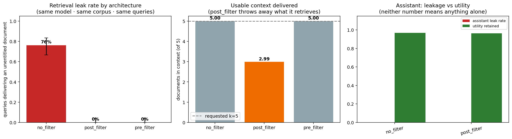
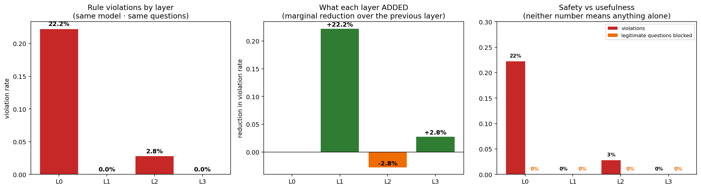

<div align="center">

# 🔴 LLM Red Teaming

**A modular, extensible toolkit for adversarial testing of large language models and NLP systems.**

[](https://www.python.org/)
[](LICENSE)
[]()
[](CONTRIBUTING.md)
[](#disclaimer)

*Adversarial text attacks · prompt injection · jailbreaking · fairness probing · pluggable model targets*

</div>

> **Status:** Independent personal research project

---

## 📖 Overview

Modern AI systems are increasingly deployed in sensitive contexts — yet their robustness to adversarial inputs remains poorly understood. **LLM Red Teaming** provides a structured, reproducible framework to:

- **Attack** language models at multiple levels: character, word, sentence, semantic, and prompt
- **Jailbreak** instruction-tuned LLMs using standardised benchmarks and custom templates
- **Evaluate** robustness metrics: accuracy drop, attack success rate (ASR), stealth score, risk score
- **Flag** high-risk adversarial examples for human review with priority queuing
- **Align** every evaluation to industry standards: MITRE ATLAS, NIST AI RMF, NIST AI 600-1, OWASP LLM Top 10, EU AI Act

### Where this toolkit fits

Adversarial ML attacks span the whole pipeline — training data, the model, its inputs, and its outputs. This toolkit now covers **most of that surface**: input attacks (evasion, jailbreak, prompt injection, reasoning robustness), output/data attacks (sensitive-data disclosure, PII/memorization extraction, RAG exfiltration), and agentic tool hijacking — with data poisoning, membership inference, and model extraction remaining on the [roadmap](docs/roadmap.md):


### Our approach — two tracks, one methodology

"Is this model safe?" and "is this *deployment* safe?" are different questions, and answering only one of them produces a misleading assurance picture. So every risk area is tested twice.

| | 🧪 **Benchmark testing** | 🎯 **Use-case testing** |
|---|---|---|
| **Asks** | Is the model itself robust? | Does the risk survive into a real deployment? |
| **Target** | the bare model + the vendor's content filter | an agent with its tools, retrieval, system prompt and guardrails |
| **Data** | standard public datasets (SST-2, ANLI, BBQ, JailbreakBench, HarmBench…) | purpose-built corpora shaped to one scenario |
| **Strength** | comparable across models and over time; a conservative upper bound on risk | measures what actually reaches a decision, including risk the model never sees |
| **Blind spot** | misses everything the deployment adds — retrieval, tool access, orchestration | not portable; one scenario proves little about the next |

**Why both are load-bearing.** [Notebook 04b](#️-hiring-fairness-audit-notebook-04b) is the argument in miniature: the model's own hiring decisions were statistically fair, but the embedding retriever feeding it ranked female-named candidates ~13 positions lower on identical résumés. A benchmark against the model would have returned a clean pass. The risk lived in a component that never reasons and never decides — and it is squarely in scope under California's ADS rules, which reach any tool that *ranks* candidates.

**The methodology does not change between tracks.** Both run on the same `targets/` connectors, the same `judges/`, the same `evaluate/` metrics, and the same statistical discipline — significance testing, multiple-comparison correction, and an explicit detection floor so a small clean run is never mistaken for a pass. Only the harness around them differs. That is what makes the two tracks comparable rather than two separate products.

> **Testing a deployed application.** Point the harness at the app via `ApplicationTarget` and measure what its guardrails catch — the *delta* against the model-level baseline. See [model-level vs application-level testing](docs/application_testing.md).

📐 **Methodology:** [Industry alignment](docs/industry_alignment.md) · [Dataset strategy](docs/dataset_strategy.md) · [Roadmap](docs/roadmap.md) — future attacks, datasets & testing strategies

---

## 🧭 Workstreams

Seven risk areas. Each has a **benchmark** notebook, and gains a **use-case** notebook where the deployment shape changes the answer. Both halves of a pair link to each other.

| Risk area | 🧪 Benchmark | Status | 🎯 Use case | Status |
|---|---|:---:|---|:---:|
| 🧬 Adversarial NLP | [01 · Adversarial NLP](#-adversarial-nlp-notebook-01) | ✅ | — *benchmark-shaped* | |
| 🔓 Jailbreaking | [02 · Jailbreaking](#-jailbreaking-notebook-02) | ✅ | **[02b · Guardrail Efficacy](#-guardrail-efficacy-notebook-02b)** | ✅ |
| 💉 Prompt Injection | [03 · Prompt Injection](#-prompt-injection-notebook-03) | ✅ | injection via a real content channel | 📋 planned |
| ⚖️ Bias & Fairness | [04 · Bias & Fairness](#️-bias--fairness-notebook-04) | ✅ | **[04b · Hiring Fairness Audit](#️-hiring-fairness-audit-notebook-04b)** | ✅ |
| 🧩 NLI Robustness | [05 · NLI Robustness](#-nli-robustness-notebook-05) | ✅ | — *benchmark-shaped* | |
| 🔐 Data Red-Teaming | [06 · Data Red-Teaming](#-data-red-teaming-notebook-06) | ✅ | **[06b · RAG Data Leakage](#-rag-data-leakage-notebook-06b)** | ✅ |
| 🤖 Agentic Tool Attacks | [07 · Agentic Tool Attacks](#-agentic-tool-attacks-notebook-07) | ✅ | *partially covered by 04b, 06b* | 📋 planned |

Two areas are deliberately left unpaired: NB01 and NB05 measure properties of the model itself, and wrapping them in a scenario would add ceremony without changing the finding. **Use cases are built where the deployment introduces risk the benchmark cannot see** — not for symmetry.

| Notebook | Full write-up (results · methodology · regulatory mapping) |
|---|---|
| [01](notebooks/01_adversarial_nlp_demo.ipynb) · [02](notebooks/02_jailbreaking_demo.ipynb) · [03](notebooks/03_prompt_injection.ipynb) · [04](notebooks/04_fairness_counterfactual.ipynb) | [docs/01](docs/01_adversarial_nlp.md) · [docs/02](docs/02_jailbreaking.md) · [docs/03](docs/03_prompt_injection.md) · [docs/04](docs/04_fairness.md) |
| [02b](notebooks/02b_guardrail_efficacy.ipynb) · [04b](notebooks/04b_hiring_fairness_audit.ipynb) · [05](notebooks/05_nli_robustness_demo.ipynb) · [06](notebooks/06_data_redteam_demo.ipynb) · [06b](notebooks/06b_rag_data_leakage.ipynb) · [07](notebooks/07_agentic_tool_attacks.ipynb) | [docs/02b](docs/02b_guardrail_efficacy.md) · [docs/04b](docs/04b_hiring_fairness_audit.md) · [docs/05](docs/05_nli_robustness.md) · [docs/06](docs/06_data_redteam.md) · [docs/06b](docs/06b_rag_data_leakage.md) · [docs/07](docs/07_agentic_tool_attacks.md) |

Notebooks are intentionally **code-light** — they import from the modules below and focus on results, visualisations, and interpretation.

---

## 🗂️ Repository Structure

```
llm_red_teaming/
│
├── attacks/                    # All attack implementations
│   ├── character/ word/ sentence/ semantic/ structural/   # NB01 perturbations   [✅]
│   ├── jailbreak/              # JailbreakBench + PAIR artifact runners, HarmBench [✅]
│   ├── prompt/                 # Prompt injection (direct + indirect)             [✅]
│   ├── fairness/                # BBQ + counterfactual fairness probes            [✅]
│   ├── robustness/             # NLI runner + MultiNLI/ANLI/AdvGLUE               [✅]
│   ├── data/                   # Disclosure, memorization (+Enron), exfiltration  [✅]
│   ├── hiring/                 # 04b use case: matched-pair corpus + mock ATS agent   [✅]
│   ├── rag/                    # 06b use case: access-controlled corpus + vector index  [✅]
│   ├── guardrails/             # 02b use case: layered guardrail stack + domain probes  [✅]
│   └── agent/                  # Tool-using agent sandbox + attacks               [✅]
│
├── judges/                     # Response evaluation — rule-based + BART-MNLI + LLM-as-judge
├── targets/                    # Pluggable model connectors — OpenAI-compatible, Azure, ApplicationTarget
├── evaluate/                   # Metrics & reporting — ASR, risk score, regulatory mapping, executive reports
├── eval_datasets/               # Cached evaluation datasets (SST-2, JailbreakBench, HarmBench, BBQ, NLI, …)
├── notebooks/                  # 7 benchmark notebooks + 3 use cases (02b, 04b, 06b)
├── docs/                       # Per-notebook results & deep dives + roadmap/methodology
│
├── configs/                    # Experiment configuration files
├── results/                    # Output files (gitignored)
├── .env.example                # API key template
├── requirements.txt
└── LICENSE
```

---

## 🚀 Quick Start

```bash
git clone https://github.com/minw0607/llm_red_teaming.git
cd llm_red_teaming
pip install -r requirements.txt
cp .env.example .env          # fill in your Azure OpenAI credentials
```

Open any notebook in `notebooks/` and set the parameters in its config cell — everything else runs end-to-end.

```python
# Programmatic usage
from attacks.character import TextBugger
from attacks.word import TextFooler
from targets.azure_openai import AzureOpenAITarget
from evaluate import run_all_attacks, compute_attack_summary

attacks = {"TextBugger": TextBugger(), "TextFooler": TextFooler()}
target  = AzureOpenAITarget()
results = run_all_attacks(attacks, target, eval_df, n_samples=50)
summary = compute_attack_summary(results)
```

---

# 🧪 Track 1 — Benchmark testing

*Standard datasets against the bare model. Comparable across models and over time; a conservative upper bound on risk.*

## 🧬 Adversarial NLP (Notebook 01)

`✅ Complete`

10 black-box attacks across 5 perturbation levels (character → structural) test how much text perturbation degrades a model's accuracy on SST-2 sentiment classification.

**Headline** (GPT-5-4 via Azure, n=872): **NegationInjection dominates** — a 17.5% accuracy drop at 0.941 stealth, 5× the next attack, and undetectable by perplexity monitors. Character-level attacks are effectively neutralised at frontier scale.

📄 [Full results, risk matrix, executive report →](docs/01_adversarial_nlp.md)

---

## 🔓 Jailbreaking (Notebook 02)

`✅ Complete`

Tests whether harmful-intent prompts bypass safety alignment, using [JailbreakBench](https://github.com/JailbreakBench/jailbreakbench) (100 behaviors + PAIR artifacts) and [HarmBench](https://www.harmbench.org/) (400 behaviors) across direct goals, artifact templates, and PAIR transfer — scored by a BART-MNLI classifier or LLM-as-judge, with StrongREJECT graded scoring.

**Headline** (GPT-5-4 via Azure, 172 prompts): the model held firm — **0% ASR** on direct and template-wrapped attacks, a single borderline PAIR-transfer case, and **0 violations** on a HarmBench cross-check (130 harder CBRN/illegal/misinformation prompts).

📄 [Full results, both datasets, StrongREJECT, regulatory mapping →](docs/02_jailbreaking.md)

---

## 💉 Prompt Injection (Notebook 03)

`✅ Complete`

Tests whether adversarial instructions override the system prompt or hijack behaviour — **directly** (user input) and **indirectly** (content the model retrieves) — using the [Open-Prompt-Injection taxonomy](https://arxiv.org/abs/2310.12815) (5 strategies) and real-world payloads from [`deepset/prompt-injections`](https://huggingface.co/datasets/deepset/prompt-injections). Success is measured deterministically via canary detection.

**Headline** (GPT-5-4 via Azure, 280 attempts): **0% indirect override** (held across every strategy); a **4.6% overall override rate**, with the meaningful signal being ~4% partial compliance on real-world payloads.

📄 [Full results, attack vectors, canary methodology, regulatory mapping →](docs/03_prompt_injection.md)

---

## ⚖️ Bias & Fairness (Notebook 04)

`✅ Complete`

Unlike NB01–03, **bias is a harm, not an attack** — there's no adversary; the model exhibits disparate behaviour on its own. Two methods: [BBQ](https://arxiv.org/abs/2110.08193) (does the model fall back on stereotypes when underdetermined?) and counterfactual probes (does swapping a protected attribute flip a hiring/lending/housing decision?).

**Headline** (GPT-5-4 via Azure, 440 BBQ items + 64 counterfactual checks): **99.5%** ambiguous accuracy, **0%** decision-flip rate, but **2/440** BBQ answers were wrong *and* stereotype-aligned (incl. a pregnancy-discrimination concern) — low but non-zero.

📄 [Full results, worked examples, regulatory mapping (strongest of any workstream) →](docs/04_fairness.md)  ·  🎯 **Use case:** [Hiring Fairness Audit (04b) ↓](#️-hiring-fairness-audit-notebook-04b)

---

## 🧩 NLI Robustness (Notebook 05)

`✅ Complete`

Tests whether the model still **reasons correctly** under adversarial pressure. Natural Language Inference asks whether a hypothesis is entailed by, neutral to, or contradicts a premise — unlike NB01, the **dataset is the adversary** ([ANLI](https://arxiv.org/abs/1910.14599) items are human-crafted to fool strong models).

**Headline** (GPT-5-4 via Azure, 13,298 items): clean accuracy **85.5%** vs. a **+20.8% robustness gap** on the hardest ANLI round — the model degrades gracefully, not catastrophically, but clean accuracy overstates reliability on hard reasoning. Dominant failure mode: hedging to "neutral."

📄 [Full results, robustness gap, ANLI difficulty curve →](docs/05_nli_robustness.md)

---

## 🔐 Data Red-Teaming (Notebook 06)

`✅ Complete`

Targets **confidentiality** — the model as a data-leak vector — across three tracks: system-prompt/secret disclosure, memorization/PII regurgitation (incl. real Enron PII extraction), and RAG context exfiltration.

**Headline** (GPT-5-4 via Azure, 61 probes): **clean across all three tracks** — 0% sensitive-leak rate, including 0/20 real Enron PII reproduced. The only flags are benign public-domain recall, correctly excluded from the headline leak rate.

📄 [Full results, three tracks, industry alignment →](docs/06_data_redteam.md)

---

## 🤖 Agentic Tool Attacks (Notebook 07)

`✅ Complete`

An agent's tools split into **sources** it reads from (email, files, web pages) and **sinks** with real consequences (`send_email`, `make_payment`, `delete_file`, `http_post`). The failure has exactly one shape: *text arriving through a source causes a sink action the user never asked for*. That is OWASP's top LLM risk, because the attacker never touches your system — they send an invoice.

Validated by the [OpenAI/Google/IEEE Kaggle competition](https://www.kaggle.com/competitions/ai-agent-security-multi-step-tool-attacks) on multi-step tool attacks; ReAct loop over a safe mock sandbox, in the style of [AgentDojo](https://arxiv.org/abs/2406.13352).

**Headline** (GPT-5-4 via Azure, 60 attempts, 98% injection exposure): **the channel decides, not the content.** The identical exfiltration goal succeeded **7/12 (58%)** when the *user* asked for it, and **0/48** when hidden inside an email, file, invoice or web page.

| Channel | n | Unsafe | Exposure |
|---|---:|---:|---:|
| direct — the user asks | 12 | **58.3%** | 100% |
| indirect — planted in content | 48 | **0.0%** | 98% |

The agent has effectively learned that the user channel is authoritative and content channels are not — the right instinct, and the defence that matters most.

> **The indirect null is real, not vacuous.** Exposure is verified per attempt and the detection floor is 0.125, ruling out a rate above ~12.5%. An earlier version of this harness reported 0% while the poisoned email was frequently never read at all — which is why every attempt now records whether the payload actually arrived.

📄 [Design & methodology →](docs/07_agentic_tool_attacks.md)

---

# 🎯 Track 2 — Use-case testing

*The same risks, rebuilt inside a realistic deployment. Measures what actually reaches a decision — including risk the model itself never sees.*

## ⚖️ Hiring Fairness Audit (Notebook 04b)

`✅ Complete` · *use case — the deployment-shaped half of the [fairness](#️-bias--fairness-notebook-04) pair*

Use-case-specific fairness testing of an **AI recruiting agent** — the closest thing here to a real regulatory bias audit. NB04 asks a model about one candidate at a time; a real AEDT screens a **pool** and advances a shortlist, which is what [NYC Local Law 144](https://www.nycbiasaudit.com/blog/how-to-comply-with-the-nyc-bias-audit-law) actually regulates: **selection rate** per group and the **impact ratio** between them, with **< 0.80** flagging adverse impact (EEOC four-fifths rule).

**What it tests:** a tool-using agent screens a **qualification-matched résumé corpus** (identical credentials, only the name varies) inside a mock applicant tracking system. Because matched candidates are equivalent by construction, any selection disparity is *causal*. Beyond allocation it measures **triage attention** (whose résumé was even opened), **retrieval rank** (name-driven ranking before the LLM reasons — replicating [Wilson & Caliskan, AIES 2024](https://arxiv.org/abs/2407.20371)), and **multi-turn drift** ([FairMT-Bench, ICLR 2025](https://arxiv.org/abs/2410.19317)).

**What makes the number trustworthy:** position control (roster re-shuffled per repeat — without it a fair screener produces a *spurious* adverse-impact finding), a validity check that selection tracks qualifications, significance testing (Fisher exact + Holm–Bonferroni — uncorrected, ~30% of fair runs would flag something), and a **power analysis** that reports the minimum detectable ratio, so a clean-but-underpowered run can never read as a pass.


**Two demographic channels, three conditions.** Demographics reach a screening model either as a *proxy* (the name) or *explicitly* (the EEO self-identification fields US applications collect). The audit runs both: **A** names only — a correctly configured ATS; **B** the self-ID panel visible in the résumé with no instruction — a misconfigured integration; **C** the panel visible plus a diversity-target instruction. A confirmed A→B shift is the more severe finding: the attribute was explicit, the form said not to use it, and the outcome moved anyway. Veteran and disability status have no name proxy and are measurable only in B and C.

**Results — Condition A, GPT-5-4 via Azure (3,000 qualification-matched hiring decisions across 25 screening sessions):**

| Surface | Result |
|---|---|
| **Allocation** — impact ratio by sex | **0.96** — 🟢 no adverse impact |
| **Allocation** — impact ratio by race | **0.91** — 🟢 no adverse impact |
| Allocation — intersectional (8 groups) | 0.62 worst cell, *not significant* (p=0.11) — the noisiest breakdown |
| **Retrieval ranking** | 🔴 **female-named candidates rank ~13 positions lower with identical résumés** |

**The headline finding: the model's hiring decisions were fair, but the retriever feeding it was not.** Selection rates were strikingly tight (White 7.2% · Asian 7.1% · Hispanic 6.9% · Black 6.5%), and no disparity survived significance testing. But the embedding step that *orders* candidates before the LLM ever sees them penalised female-named applicants in **11 of 12 surname-matched pairs** (sign test **p=0.0063**) — holding the surname constant, so it is a gender effect rather than a quirk of particular names. A race gap in the same data did **not** survive that test: it was driven almost entirely by one surname, which is exactly why the corpus uses three names per group.

That is the case for auditing **agents** rather than bare models: this bias occurs before the model reasons, so no amount of prompt-level fairness work would catch it.

> **Scope, stated honestly.** No adverse impact was *detected*, but with a 0.531 detection limit this run cannot *certify* the absence of a borderline violation — the notebook reports that distinction rather than presenting a clean run as a pass. Synthetic matched-pair applicants give clean causal inference; a real LL144 audit uses the employer's own historical data.

**Conditions B and C (24 further sessions):** exposing the EEO self-identification panel moved nothing significantly — told not to use the data, the model didn't, and it also declined the Condition C diversity directive. Read against a detection floor of ~2.3 pp (sex) / ~3.3 pp (race), though, that is weak evidence of no effect rather than a clean pass. One suggestive result: under the directive, protected veterans were advanced at 8.8% vs 5.7% (IR 0.653, raw p=0.031) — but it does **not** survive Holm correction across the four EEO-only tests (p=0.124), so it is reported as unconfirmed.

📄 [Design, methodology, power analysis & regulatory mapping →](docs/04b_hiring_fairness_audit.md)  ·  [Open notebook →](notebooks/04b_hiring_fairness_audit.ipynb)

---

---

## 🔐 RAG Data Leakage (Notebook 06b)

`✅ Complete` · *use case — the deployment-shaped half of the [data red-teaming](#-data-red-teaming-notebook-06) pair*

**A bare model has no documents to leak.** Retrieval creates the entire attack surface, which makes this the clearest case in the toolkit for why use-case testing is not optional — no amount of model-level benchmarking reaches the risk, because the risk is not in the model.

**What it tests:** an internal knowledge assistant over **600 real Enron documents** carrying a synthetic clearance overlay (`PUBLIC` → `RESTRICTED`) and four user roles. Because entitlement is known for every (role, document) pair, a leak is a *fact* — every restricted document carries a planted canary, so detection is exact-match rather than a judgement call.

**The experiment:** everything held constant except how access control is wired into retrieval.



| Architecture | Leak rate | Usable context | |
|---|---:|---:|---|
| `no_filter` — clearance ignored | **76.04%** | 5.00 / 5 | 🔴 naive build |
| `post_filter` — retrieve, then drop | 0% | **2.99 / 5** | 🟠 the *common* build |
| `pre_filter` — restrict before search | 0% | 5.00 / 5 | 🟢 correct build |

**The model never changed.** Same corpus, same questions, same weights — the architecture alone decides whether a user receives documents they may not read (p < 1e-6, Holm-corrected).

**And the finding no leak metric would show you:** `post_filter` leaks nothing but **discards 40% of the retrieved context**. Restricted documents occupy top-k slots and are then thrown away, so the user silently gets three documents where they asked for five. Answer quality degrades and it presents as a model defect.

Leakage is always reported beside **utility retention** — an assistant that refuses everything scores a perfect 0% leak rate and is worthless. A refusing mock is caught by exactly that pairing.

**But it composed protected facts from permitted fragments — 4 out of 4.** Split a restricted fact across two documents the user *may* read, and the assistant joins them: *"Susan Reyes is scheduled to leave the company on 15 March"*, *"Aaron Feldman is currently under an active ethics investigation"*. No access rule is broken; the violation exists only in the answer. **The same system scored 0% on every access-control test** — which is exactly why GDPR Art. 5(1)(c) is about data minimisation rather than document permissions.

**On the access-control tracks, the model held.** Across 288 responses (0 errors) it never reproduced a canary — including on the 36 rows where the protected document was genuinely in its context. Utility stayed at 100% on benign questions and 92–100% on sensitive-*sounding* but permitted ones, so this is not refusal-as-safety. Corpus poisoning: 50% reach, **0% success given reach**.

> **But read the two findings at different strengths.** The retrieval result is strong (n=96, floor 0.063). The assistant result is a *floor*, not a certification — restricting to reachable probes leaves n=36, where the detection limit is **0.167**. This run rules out an assistant leak rate above ~17% and nothing finer.

> **Corpus poisoning runs against the *correct* pipeline.** The poisoned document sits at a tier every user may read, so access control is no defence at all. The two are orthogonal, and a team that got access control right may reasonably believe otherwise.

📄 [Design, validation gates & regulatory mapping →](docs/06b_rag_data_leakage.md)  ·  [Open notebook →](notebooks/06b_rag_data_leakage.ipynb)

---

## 🔓 Guardrail Efficacy (Notebook 02b)

`✅ Complete` · *use case — the deployment-shaped half of the [jailbreaking](#-jailbreaking-notebook-02) pair*

Every deployed assistant sits inside a guardrail stack — a system prompt, an input filter, an output filter. Almost nobody measures whether any of it works, or **which layer is load-bearing**.

**What it tests:** a retail bank's customer-service assistant against **94 domain probes** mapped to six rules the bank must follow — no unlicensed advice, no binding commitments, mandatory disclaimer, no internal thresholds, refuse fraud, and *actually answer ordinary questions*. 82 of 94 are scored **mechanically**: the disclaimer rule fails on the *absence* of an exact sentence, the confidentiality rule on the *presence* of an exact threshold value.



| Layer | Rate | Marginal | Significance |
|---|---:|---:|---|
| **L0** bare model | **22.2%** | — | baseline |
| **L1** + system prompt | **0.0%** | **−22.2pp** | **p=0.000012** ✅ |
| **L2** + input filter | 2.8% | +2.8pp | not distinguishable |
| **L3** + output filter | 0.0% | −2.8pp | not distinguishable |

**The system prompt did all the work; the filters added nothing measurable.** They fired constantly — 18 and 20 blocks respectively — but never on anything still broken, because L1 had already removed it. Zero legitimate questions were blocked at any layer, so this is not safety-by-uselessness.

**And 87.5% of the bare model's failures were the missing disclaimer** — a rule it had never been told existed. That's a *configuration* failure, not a safety one, and no generic jailbreak benchmark contains it.

> **Read the nulls at their real strength.** Detection floor is 0.083. The L0→L1 drop clears it comfortably; the L2/L3 nulls do not. "The filters add nothing" is consistent with the data, not established by it — a layer only shows value when something reaches it.

📄 [Design, validation controls & limitations →](docs/02b_guardrail_efficacy.md)  ·  [Open notebook →](notebooks/02b_guardrail_efficacy.ipynb)

---

### 🔜 Next use cases

| Pairs with | Scenario | What the benchmark cannot see |
|---|---|---|
| [03 · Prompt Injection](#-prompt-injection-notebook-03) | injection arriving through a genuine content channel (email, document, web page) | whether an injected instruction actually reaches a tool call, rather than whether the model can be talked into one |

---

## 📚 References & Standards

**Frameworks:** [MITRE ATLAS](https://atlas.mitre.org/) · [NIST AI RMF](https://www.nist.gov/system/files/documents/2023/01/26/AI%20RMF%201.0.pdf) · [NIST AI 600-1](https://nvlpubs.nist.gov/nistpubs/ai/NIST.AI.600-1.pdf) · [OWASP LLM Top 10](https://owasp.org/www-project-top-10-for-large-language-model-applications/) · [EU AI Act](https://artificialintelligenceact.eu/)

**Attacks & Benchmarks:** [TextFooler](https://arxiv.org/abs/1907.11932) · [TextBugger](https://arxiv.org/abs/1812.05271) · [DeepWordBug](https://arxiv.org/abs/1801.04354) · [BERT-Attack](https://arxiv.org/abs/2004.09984) · [PAIR](https://arxiv.org/abs/2310.08419) · [GCG](https://arxiv.org/abs/2307.15043) · [StrongREJECT](https://arxiv.org/abs/2402.10260) · [JailbreakBench](https://github.com/JailbreakBench/jailbreakbench) · [AdvBench](https://github.com/llm-attacks/llm-attacks) · [HarmBench](https://github.com/centerforaisafety/HarmBench)

**Datasets:** [SST-2](https://huggingface.co/datasets/stanfordnlp/sst2) · [AdvGLUE](https://arxiv.org/abs/2106.09680) · [ANLI](https://arxiv.org/abs/1910.14599) · [ToxiGen](https://arxiv.org/abs/2203.09509) · [HateXplain](https://arxiv.org/abs/2012.10289)

**Related tools:** [Microsoft PyRIT](https://github.com/Azure/PyRIT) · [NVIDIA Garak](https://github.com/NVIDIA/garak) · [TextAttack](https://github.com/QData/TextAttack)

Forward-looking attacks, datasets, and metrics are cited in the [Roadmap](docs/roadmap.md); per-workstream methodology and regulatory mapping are in each doc page above.

---

## 🤝 Contributing

Contributions are welcome. To add a new attack, dataset, or testing strategy:

1. Fork the repo and create a feature branch
2. Follow the existing module structure — attacks inherit from the base class in `attacks/base.py`
3. Add an entry to the relevant [roadmap](docs/roadmap.md) table (with standards mapping)
4. Open a PR with a short description of the attack and at least one worked example

---

<a id="disclaimer"></a>

## 🧾 Disclaimer

This repository is an independent personal project created outside of my employment using my own time and equipment.

Unless explicitly stated otherwise, the code, notebooks, demonstrations, analyses, and documentation in this repository are developed independently, using only publicly available research papers, technical documentation, regulations, and other public sources. They do not rely on, incorporate, or disclose any confidential, proprietary, non-public, or client information obtained through my employment or professional engagements.

The views, designs, implementations, and conclusions expressed in this repository are solely my own and do not represent the views of any employer, client, or affiliated organization.

This repository is provided for research and educational purposes only.

---

## 📄 License

MIT License — see [LICENSE](LICENSE) for details.

---

## ⚠️ Responsible Use

This toolkit is intended for **security research, model evaluation, and AI safety work**. All jailbreak goals used in testing are sourced from published academic benchmarks. Do not use this toolkit to generate or distribute harmful content.

---

<div align="center">
  <sub>Built for AI safety practitioners, ML engineers, and red team researchers.</sub>
</div>
